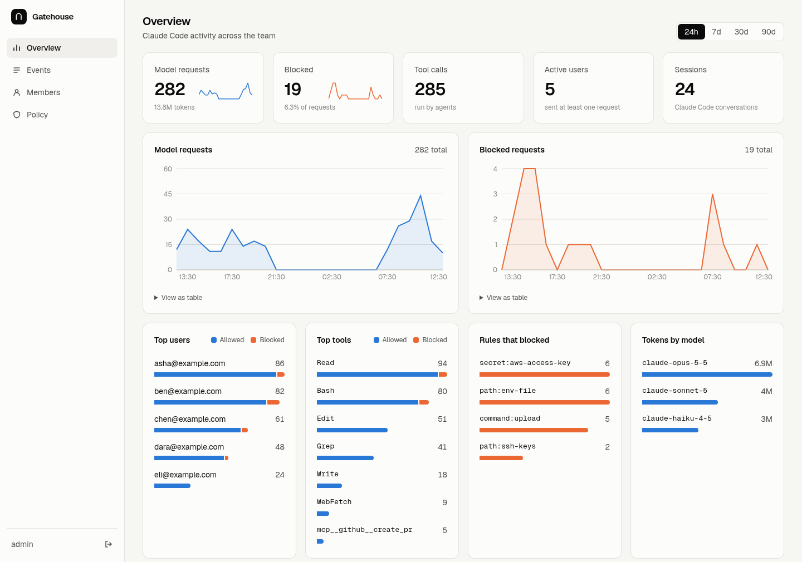

# Gatehouse

A self-hosted policy and audit proxy for Claude Code.

Each person keeps using Claude Code signed in with their own Claude account. Gatehouse sits between Claude Code and Anthropic, blocks requests that break your policy, and records who did what. Nothing is installed on laptops: a person connects by setting one URL.



## What it does

- **Pass-through proxy.** Forwards every request to Anthropic unchanged, including the user's own login, which is never stored or logged.
- **Policy.** Refuses a request before it leaves when the conversation contains a tool call on a denied path, a denied shell command, a secret, or an MCP tool that is not approved.
- **Audit trail.** Records prompts, tool calls, model requests, token counts and blocks per user and session, in SQLite.
- **Dashboard.** Activity, blocks, top users and tools, a searchable event log, members and the active policy.

It is one Go binary with the React dashboard built in.

## Quick start

You need Go 1.22 or newer (it fetches the toolchain it needs) and Node 22.

```sh
git clone https://github.com/cdmx-in/gatehouse && cd gatehouse
make
GATEHOUSE_ADMIN_PASSWORD=choose-a-password ./gatehouse
```

Open http://127.0.0.1:8787 and sign in as `admin`.

## Connect Claude Code

In the dashboard, go to **Members → Add member**. It shows a snippet once:

```json
{
  "env": { "ANTHROPIC_BASE_URL": "https://your-gatehouse-host/m/gt_..." },
  "skipWebFetchPreflight": true
}
```

The person adds it to `~/.claude/settings.json` and keeps using Claude Code as before. Removing the member revokes the URL.

## Policy

Rules live in `policy.json` and are regular expressions:

| Key | Blocks a request when |
|---|---|
| `deny_paths` | the agent read, edited or listed a matching path |
| `deny_commands` | the agent ran a matching shell command |
| `secrets` | any part of the conversation matches |
| `allow_mcp` | the request carries an MCP tool that matches none of these. Leave the key out for no MCP restriction |

A blocked conversation stays blocked until the person runs `/rewind` or `/clear`, because the offending content is still in its history. The shipped rules are a starting point; tune them for your team.

## Configuration

| Variable | Default | |
|---|---|---|
| `GATEHOUSE_ADMIN_PASSWORD` | required | dashboard password |
| `GATEHOUSE_ADMIN_USER` | `admin` | dashboard username |
| `GATEHOUSE_ADDR` | `127.0.0.1:8787` | listen address; put TLS in front of it |
| `GATEHOUSE_DB` | `gatehouse.db` | SQLite audit store |
| `GATEHOUSE_POLICY` | `policy.json` | rules, read at startup |
| `GATEHOUSE_RETENTION_DAYS` | `365` | audit rows older than this are deleted |
| `GATEHOUSE_UPSTREAM` | `https://api.anthropic.com` | |

## Before you rely on it

- **It is only a control if it is the only route.** Block `api.anthropic.com` on your network for everything except the Gatehouse server, and keep `claude.ai` and `platform.claude.com` open for sign-in.
- **It stops data leaving, not commands running.** Gatehouse sees a tool call when its result is sent to the model, so the command has already run on the laptop.
- **The member URL is the identity.** Anyone holding it can send as that person.
- **The audit store is sensitive.** It holds file paths and commands, and full prompt text if you set `log_content`.
- **Check Anthropic's terms for your plan.** Anthropic restricts routing Claude subscription credentials through other services. See [Authentication and credential use](https://code.claude.com/docs/en/legal-and-compliance) and confirm your setup with Anthropic.
- **Early software.** It has one admin account, policy changes need a restart, and it has not had a security review.

## Development

```sh
make test                 # go vet and the end-to-end test against a fake upstream
cd web && npm run dev     # dashboard with hot reload, proxying to a local Gatehouse on :8787
```

## License

MIT. This project is not affiliated with or endorsed by Anthropic.
